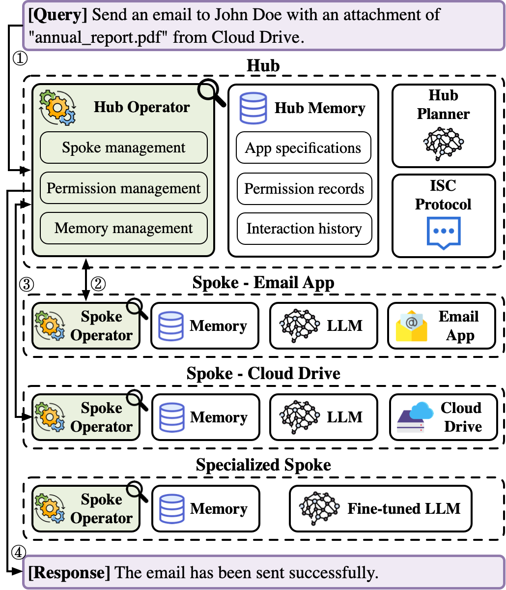

# Artifact Evaluation - IsolateGPT

IsolateGPT is an LLM-based system that secures the execution of LLM apps via isolation. The key idea behind IsolateGPT is to isolate the execution of apps and to allow interaction between apps and the system only through well-defined interfaces with user permission. IsolateGPT can defend against multiple types of attacks, including app compromise, data stealing, inadvertent data exposure, and uncontrolled system alteration. The architecture of IsolateGPT is shown in the figure below. 

**Note:** IsolateGPT has been accepted for publication at the NDSS Symposium 2025. For more details about IsolateGPT, please refer to the paper titled "IsolateGPT: An Execution Isolation Architecture for LLM-Based Systems."


<p align="center"></p>

*This document primarily provides instructions for setting up the runtime environments and executing the artifacts of IsolateGPT. For artifact evaluation, we recommend using our pre-configured virtual machine (VM) to ease the evaluation process. Please follow the instructions in the submitted AE appendix to evaluate the artifacts.*


## Table of Contents
- [Artifact Evaluation - IsolateGPT](#artifact-evaluation-isolategpt)
  - [Installation](#installation)
  - [Setup](#setup)
  - [Testing](#testing)
  - [Case Studies](#case-studies)
  - [Measurements](#measurements)
  - [Research Team](#research-team)


## Installation

### Conda environment
To set up the environment, we suggest using Conda to install all necessary packages. Conda installation instructions can be found [here](https://docs.anaconda.com/free/miniconda/miniconda-install/). The following setup assumes Conda is installed and is running on a Linux/macOS system (though Windows should work too).

To get started, clone the IsolateGPT repository and navigate to its directory.

```sh
git clone https://github.com/llm-platform-security/SecGPT
cd SecGPT
git checkout IsolateGPT-AE
```

Then, create and set up the conda environment with the provided `environment.yml` file: 

```sh
conda env create -f environment.yml
```

And activate the conda environment:

```sh
conda activate isolategpt
```

### Database
To enable long-term memory in IsolateGPT, install the Redis database (using Ubuntu as an example):

```sh
sudo apt install redis-server
```

## Setup
### API keys
Before running IsolateGPT, you need to set the OpenAI API key for the used LLM (GPT-4 by default), select apps to enable, and authorize apps that require authorization. 

First, specify your API key for the LLM in `data/env_variables.json`:

```json
{
    "OPENAI_API_KEY" : ""
}
```

If you need to run measurements, also specify the API key in `measurements/data/env_variables.json`. Also, you need [LangChain API key](https://docs.smith.langchain.com/how_to_guides/setup/create_account_api_key) to be set in `measurements/data/env_variables.json` to run evaluators for functionality correctness score calculation.


### Path & app configurations
After setting the API keys, specify the root path of the local IsolateGPT repository with an absolute path in `helpers/configs/configuration.py`:

```python
root_path = ""
```

Note that there are some absolute paths in the repository, you can simply search '/home/isolategpt/Desktop/SecGPT-IsolateGPT-AE/' and replace them with the local repository path.

Then, set enabled functionalities/toolkits/annotations in `data/functionalities.json`. For example, if you want to enable Google Drive and Gmail App, select the corresponding functionality names from `available_functionalities` and specify them in `installed_functionalities`.

```json
{
    "installed_functionalities": [
        "google_drive_retrieve"
    ]
}
```

Finally, some apps require authorization. To authorize these apps, please follow their documentation. For example, see the steps for setting up Google Drive [here](https://python.langchain.com/docs/integrations/retrievers/google_drive) and Gmail [here](https://python.langchain.com/docs/integrations/toolkits/gmail). Particularly, for these services, you need to enable the corresponding API (e.g., Gmail API) for your cloud API account, create OAuth credentials, download credentials, and rename the downloaded credential file as `credentials.json`, which should be stored at the `data/credentials.json` path. For other app settings, such as the app token storage path, please refer to `helpers/configs/configuration.py`.

**Troubleshooting:** If you encounter the `NameError: name 'Callbacks' is not defined` when using the Google Drive tool, please modify the function definition of `get_relevant_documents` in the library file `...langchain_core/retrievers.py`:
```python
def get_relevant_documents(
    self,
    query: str,
    *,
    callbacks: Any = None, # Replace "Callbacks" with "Any"
    tags: Optional[List[str]] = None,
    metadata: Optional[Dict[str, Any]] = None,
    run_name: Optional[str] = None,
    **kwargs: Any,
) -> List[Document]:
```
Additionally, modify the function definition of `aget_relevant_documents` in that file in the same manner.

**Add More Apps:** If you want to add more apps, please initialize them in `helpers/tools/tool_importer.py`, add their specifications to `helpers/tools/specifications`, and enable them in `data/functionalities.json`. For more details, please refer to the code and settings of existing apps.

**Advanced Setup:** We isolate the execution of the spokes and the hub by running them in separate processes. We leverage the seccomp (for Linux) and setrlimit (see [here](https://healeycodes.com/running-untrusted-python-code) for more details) system utilities to restrict access to system calls and set limits on the resources a process can consume. Specifically, we allow access to needed system calls and limit the CPU time, maximum virtual memory size, and maximum size of files that can be created, within a process. Additionally, the network requests from an app are restricted to their root domain (i.e., eTLD+1). All these settings can be modified in `helpers/sandbox/sandbox.py`.

## Testing
To verify the setup of IsolateGPT, run a case study using the `isolategpt_case_studies.py` script and check if it executes without errors.

```sh
python isolategpt_case_studies.py
```

## Case Studies
IsolateGPT's goals are to: 
1. Protect the apps from getting compromised by/through other apps 
2. Protect stealing of app and system data by/through other apps
3. Avoid the ambiguity and imprecision of natural language inadvertently compromising app functionality
4. Avoid the ambiguity and imprecision of natural language inadvertently exposing user data

To demonstrate protection against these attacks, we implement them in four case studies. For each case study, you can run on IsolateGPT (with `isolategpt_case_studies.py`) and VanillaGPT (`vanillagpt_case_studies.py`), then compare their intermediate steps and outputs. For example, you can run the case study 1 (app compromise) on IsolateGPT using the following command: 

```sh
python isolategpt_cast_studies.py --case 1
```  

To enable seamless artifact evaluation, we also develop a shell script for running all case studies on both IsolateGPT and VanillaGPT. The script can be executed by:

```sh
./run_case_studies.sh
```

## Measurements

Although including additional components to improve the security of LLM-based systems, the performance overheads incurred by IsolateGPT are reasonable and it provides similar functionality as a non-isolated LLM-based system. To demonstrate these, we conduct measurements using [LangChain Benchmarks](https://langchain-ai.github.io/langchain-benchmarks/). 

### Benchmark
In this repo, we provide the [Relational Data benchmark](https://langchain-ai.github.io/langchain-benchmarks/notebooks/tool_usage/relational_data.html) in `measurements/dataset`, which is used to evaluate IsolateGPT in addressing complex user queries that require collaboration among multiple apps. 

### Performance analysis

This experiment involves evaluating the performance overhead of IsolateGPT, in comparison to VanillaGPT. A shell script, `run_measurements.sh`, is provided to run a representative benchmark (LangChain's Relational Data benchmark), capturing the time taken by various system components. 

To execute, activate the conda environment, navigate to the `measurements` directory, and run the script using the following command:

```sh
./run_measurements.sh
```

The performance comparison results are saved in the `measurements/results` folder, with detailed breakdowns in `perf_compare.csv` and individual query times in the respective runtime files for IsolateGPT and VanillaGPT. 


### Functionality correctness analysis
To verify that the added security components in IsolateGPT do not degrade its functionality, this experiment compares the correctness of IsolateGPT against VanillaGPT using the same benchmark from the performance evaluation. 

After running the `run_measurements.sh` script, run the script for functionality analysis using:

```sh
./run_func_eval.sh
```

After running the script, the correctness analysis results are stored in `func_compare.txt` under `measurements/results`, showing scores for both intermediate steps and the final output.


## Research Team 
If you encounter any problems for running the artifact, please contact our research team.

[Yuhao Wu](https://yuhao-w.github.io) (Washington University in St. Louis)  
[Franziska Roesner](https://www.franziroesner.com/) (University of Washington)  
[Tadayoshi Kohno](https://homes.cs.washington.edu/~yoshi/) (University of Washington)  
[Ning Zhang](https://cybersecurity.seas.wustl.edu/) (Washington University in St. Louis)  
[Umar Iqbal](https://umariqbal.com) (Washington University in St. Louis)  


## Citation
```plaintext
@inproceedings{wu2025isolategpt,
  title={{IsolateGPT: An Execution Isolation Architecture for LLM-Based Systems}}, 
  author={Wu, Yuhao and Roesner, Franziska and Kohno, Tadayoshi and Zhang, Ning and Iqbal, Umar},
  booktitle={Network and Distributed System Security Symposium (NDSS)},
  year={2025},
}
```